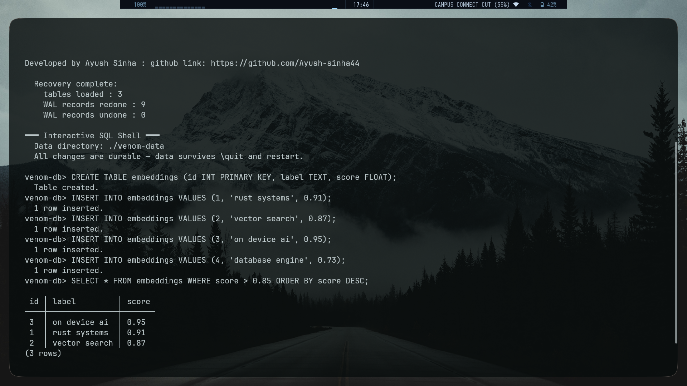
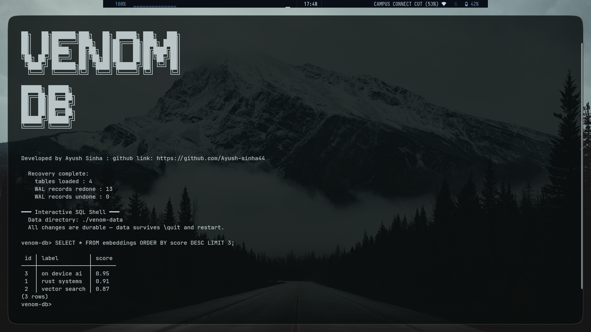

# venom-db

> An embedded, ACID-compliant relational database engine written from scratch in Rust.




venom-db is an embedded relational database engine implemented from scratch in Rust. It does not rely on third-party storage engines, external query parsers, or key-value abstractions. Every subsystem—from slotted page serialization and the Write-Ahead Log (WAL) to Two-Phase Locking (2PL) and B-Tree/HNSW indexes—is designed directly within the repository.

The goal is to provide a single-file, in-process database with full ACID guarantees suitable for embedded environments and local AI workloads (such as on-device RAG pipelines and offline assistant storage).

---

## Overview & Technical Rationale

Modern on-device AI applications often pair a relational database for structured metadata with a separate vector database for embeddings. This pattern introduces multiple failure modes, separate query APIs, and inconsistent durability semantics.

venom-db addresses this by combining structured SQL query execution, transaction processing with crash recovery, and vector similarity search into a unified engine.

---

## Implemented Features

### Hand-Rolled SQL Parser & Executor
- Custom Lexer and Parser building an Abstract Syntax Tree (AST).
- Supported Statements: `CREATE TABLE`, `INSERT`, `SELECT`, `UPDATE`, `DELETE`.
- Filtering & Sorting: `WHERE` clauses with binary comparison (`=`, `!=`, `<`, `>`, `<=`, `>=`) and logical operators (`AND`, `OR`), `ORDER BY` (ASC/DESC), and `LIMIT`.
- Cross-type integer to float evaluation with NaN ordering handling.

### Core Data Types
- `INT` (64-bit signed integer)
- `TEXT` (variable-length string)
- `FLOAT` (64-bit IEEE 754 floating-point, 8-byte LE slotted page encoding)
- `NULL` (supports `IS NULL`, `IS NOT NULL`, and ternary equality logic)

### Primary Keys & In-Memory B-Tree Indexing
- Strict enforcement of `PRIMARY KEY` uniqueness and non-null constraints on `INSERT` and `UPDATE`.
- Automatic B-Tree index creation on primary key columns.
- Query optimizer automatically routes equality and range predicates (`=`, `>`, `<`, etc.) to B-Tree scans instead of sequential heap scans.
- In-memory indexes are automatically rebuilt from durable heap pages on engine startup.

### HNSW Vector Indexing (Standalone Engine Implemented)
- Hierarchical Navigable Small World (HNSW) graph index implementation based on Malkov & Yashunin (2016).
- Distance Metrics: Euclidean ($L_2$), Cosine distance (default for text embeddings), and Dot Product.
- Parameterized configuration (`M`, `m_max`, `ef_construction`, `ef_search`, `ml`).
- Graph statistics tracking (`HnswStats`) and deterministic build options for reproducible testing.

### Write-Ahead Logging (WAL) & Crash Recovery
- Append-only `venom.wal` transaction log using strict WAL protocol (log written before page modification).
- Automatic startup recovery: replays committed transactions and rolls back uncommitted writes.
- Catalog schema metadata (`catalog.bin`) is serialized in a versioned binary format that survives process restarts.

### Buffer Pool Management & Storage
- Slotted page architecture for variable-length tuple storage inside fixed-size pages.
- Buffer Pool Manager with page pinning, LRU eviction policy, and dirty page flushing to `data.db`.
- Table page allocation tracking via `.pages` files.

### Concurrency Control
- Strict Two-Phase Locking (SS2PL) with shared (read) and exclusive (write) row-level locks.
- Wait-For Graph cycle detection for automatic deadlock detection and transaction abortion.

---

## Architecture Overview

```
┌─────────────────────────────────────────────┐
│               SQL Frontend                  │
│         Lexer -> Parser -> AST              │
│              src/sql/                       │
└────────────────────┬────────────────────────┘
                     │ AST
┌────────────────────▼────────────────────────┐
│            Execution Engine                 │
│   Executor: scans, filters, sorts, writes   │
│   IndexManager: B-Tree & HNSW routing       │
│           src/engine/                       │
└──────┬─────────────────────┬────────────────┘
       │                     │
┌──────▼──────┐    ┌─────────▼──────────────┐
│ Concurrency │    │   Storage & Buffer Pool │
│  Strict 2PL │    │  Slotted Pages, Heap    │
│  Wait-For   │    │  Buffer Pool Manager    │
│  Deadlocks  │    │      src/storage/       │
│src/concurr..│    └────────────┬────────────┘
└─────────────┘                 │
                   ┌────────────▼────────────┐
                   │     Recovery & WAL      │
                   │  venom.wal append log   │
                   │  Crash recovery replay  │
                   │     src/recovery/       │
                   └────────────┬────────────┘
                                │
                   ┌────────────▼────────────┐
                   │      Catalog Store      │
                   │  Versioned binary schema│
                   │  src/storage/catalog_   │
                   │        store.rs         │
                   └─────────────────────────┘
```

---

## Project Structure

```
venom-db/
├── assets/
│   ├── readme1.png
│   └── readme2.png
├── Cargo.toml
├── src/
│   ├── buffer/
│   │   ├── buffer_pool.rs
│   │   ├── frame.rs
│   │   ├── lru_replacer.rs
│   │   └── mod.rs
│   ├── concurrency/
│   │   ├── lock_manager.rs
│   │   ├── mod.rs
│   │   └── transaction.rs
│   ├── engine/
│   │   ├── catalog.rs
│   │   ├── executor.rs
│   │   ├── index_manager.rs
│   │   └── mod.rs
│   ├── index/
│   │   ├── btree.rs
│   │   ├── hnsw/
│   │   │   ├── distance.rs
│   │   │   └── mod.rs
│   │   ├── node.rs
│   │   └── mod.rs
│   ├── recovery/
│   │   ├── log_record.rs
│   │   ├── mod.rs
│   │   └── wal.rs
│   ├── sql/
│   │   ├── ast.rs
│   │   ├── lexer.rs
│   │   ├── mod.rs
│   │   └── parser.rs
│   └── storage/
│       ├── catalog_store.rs
│       ├── disk_manager.rs
│       ├── page.rs
│       └── mod.rs
└── main.rs
```

---

## Getting Started

### Prerequisites

- Rust toolchain (stable, 1.70+)
- Cargo

### Building and Running

```bash
git clone https://github.com/Ayush-sinha44/venom-db.git
cd venom-db
cargo build --release
cargo run
```

Interactive REPL usage example:

```sql
venom-db> CREATE TABLE products (id INTEGER PRIMARY KEY, name TEXT, price FLOAT);
venom-db> INSERT INTO products VALUES (1, 'keyboard', 29.99);
venom-db> INSERT INTO products VALUES (2, 'monitor', 149.99);
venom-db> SELECT * FROM products WHERE price > 50.0;
venom-db> UPDATE products SET price = 34.99 WHERE id = 1;
venom-db> SELECT * FROM products ORDER BY price DESC;
```

---

## Testing Verification

The engine is verified by a suite of 141 tests covering unit, component, and integration workflows:

- **Buffer Pool**: Pin/unpin counting, LRU eviction, dirty page flushing.
- **Concurrency**: Shared/exclusive lock acquisition, deadlock cycle detection and victim selection.
- **Catalog**: Binary schema serialization, version compatibility.
- **B-Tree Index**: Insertion, key lookup, range scans across leaf nodes, node splitting.
- **HNSW Index**: Recall metrics (Euclidean & Cosine), edge case handling (k=0, single-dimension, high cardinality), triangle inequality, graph telemetry.
- **WAL Recovery**: Log record serialization, committed transaction replay, uncommitted transaction rollback.
- **SQL & Executor**: Lexer/parser AST verification, filtering, ORDER BY, LIMIT, PRIMARY KEY enforcement, FLOAT sorting/comparisons.

Run tests using:

```bash
cargo test
```

---

## Roadmap

- [ ] **HNSW Integration into SQL Layer**: Expose vector type in DDL and integrate vector distance sorting (`ORDER BY embedding <-> [...] LIMIT k`) into the executor.
- [ ] **WAL Checkpointing**: Implement periodic checkpointing to bound recovery replay time and truncate `venom.wal`.
- [ ] **MVCC Concurrency**: Transition to Multi-Version Concurrency Control for non-blocking read operations.

---

## License & Project Notes

*venom-db is an educational storage engine built for learning systems programming and database internals in Rust.*

Author: **Ayush Sinha**  
GitHub: [Ayush-sinha44](https://github.com/Ayush-sinha44)
