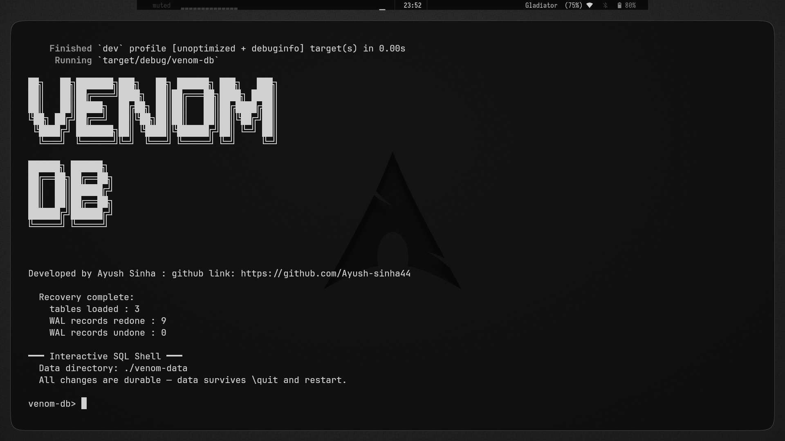
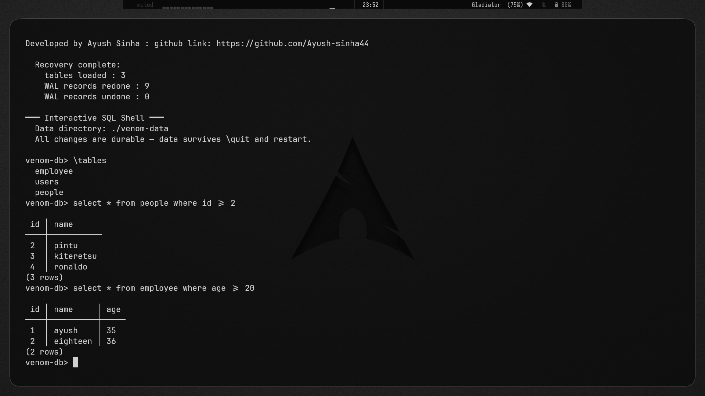

# venom-db

> An embedded, ACID-compliant relational database engine written from scratch in Rust.




venom-db is a relational database engine built entirely from scratch in Rust — no external storage libraries, no borrowed query engines, no shortcuts. Every layer, from the on-disk page format to the SQL parser to the Write-Ahead Log, is hand-built and purpose-designed.

The goal is an embedded database in the spirit of SQLite: a single-file, in-process store that ships with your application, requires no server, and provides full ACID guarantees. The long-term target is to serve as the storage layer for on-device AI applications — local RAG pipelines, personal AI assistants, and offline agents that need durable relational storage and vector similarity search in one engine, without a cloud dependency.

---

## Why venom-db?

On-device AI is shifting from a niche experiment to a default architecture. Models like Gemma E2B/E4B now run fully offline on smartphones and edge devices. But these applications still glue together two separate stores: a relational database for structured metadata, and a vector store for embeddings. That means two APIs, two failure modes, two sets of durability semantics to reason about.

venom-db is being built to close that gap — a single embedded engine that handles structured SQL queries, ACID-compliant transactions, crash recovery, and (on the roadmap) native HNSW vector indexing in one place. Think SQLite, but with vector search as a first-class citizen rather than a bolted-on extension.

---

## Current Features

### SQL Engine

venom-db ships a hand-rolled Lexer and Parser that converts raw SQL strings into an Abstract Syntax Tree, which the Executor then walks to carry out the query. No parser generators, no third-party SQL libraries.

Supported statements:

```sql
-- DDL
CREATE TABLE users (id INTEGER PRIMARY KEY, name TEXT, age INTEGER);

-- DML
INSERT INTO users VALUES (1, 'Ayush', 20);
INSERT INTO users VALUES (2, 'Faasm', 21);

SELECT * FROM users;
SELECT id, name FROM users WHERE age > 20;
SELECT * FROM users WHERE id = 1;

UPDATE users SET age = 22 WHERE id = 2;

DELETE FROM users WHERE age < 20;
```

### Advanced Querying

WHERE clause filtering supports multi-condition expressions with comparison operators (`=`, `!=`, `<`, `>`, `<=`, `>=`) and logical operators (`AND`, `OR`). The executor evaluates predicates directly on in-memory tuples after page retrieval.

ORDER BY with ascending and descending sort is fully supported:

```sql
SELECT * FROM users ORDER BY age DESC;
SELECT * FROM users WHERE age > 18 ORDER BY name ASC LIMIT 10;
```

LIMIT truncates result sets to a fixed row count, enabling efficient pagination-style queries.

### Primary Key Enforcement

Columns declared as `PRIMARY KEY` are enforced at both INSERT and UPDATE time. Duplicate key insertions are rejected with an explicit error. NULL values in a primary key column are also rejected. The primary key column is automatically indexed via a B-Tree on table creation.

### B-Tree Indexing

venom-db maintains in-memory B-Tree indexes for accelerated lookups. The executor performs cost-aware query routing: when a WHERE clause includes an equality or range predicate on an indexed column, the B-Tree index is used instead of a full sequential heap scan. This is handled transparently — no query hints required.

Indexes are registered in the catalog and rebuilt from heap pages on every startup, since the index lives in memory and the WAL-recovered heap pages are the source of truth.

```sql
-- This uses the B-Tree index on `id` automatically
SELECT * FROM users WHERE id = 42;

-- Range queries also route through the index
SELECT * FROM users WHERE id > 100;
```

### Write-Ahead Logging (WAL)

Every mutating operation — INSERT, UPDATE, DELETE — writes a log record to `venom.wal` before touching any in-memory page. This is the standard WAL protocol used by production databases including PostgreSQL and SQLite.

On crash and restart, venom-db replays the WAL:
- Committed transactions are redone against the recovered heap pages
- Uncommitted transactions are rolled back, leaving the database in a consistent pre-crash state

This gives venom-db genuine durability: no committed write is ever lost, even if the process is killed mid-operation.

### Buffer Pool Manager

The Buffer Pool Manager sits between the disk and the execution engine. It maintains a fixed-size cache of disk pages in RAM and handles:

- **Page pinning** — active pages are pinned in memory during a transaction and cannot be evicted
- **Dirty page tracking** — modified pages are marked dirty and flushed to `data.db` at transaction commit
- **Page eviction** — when the pool is full, clean pages are evicted to make room for new ones

Table-to-page mappings are tracked using lightweight `.pages` metadata files alongside the main data file.

### Two-Phase Locking (2PL) with Deadlock Detection

venom-db implements strict Two-Phase Locking for concurrency control. Transactions acquire shared (read) locks before accessing rows and exclusive (write) locks before mutating them. Locks are held until the transaction commits or aborts — this is the "strict" variant of 2PL, which prevents dirty reads, non-repeatable reads, and lost updates.

A cycle-detection algorithm runs on the lock wait graph to identify deadlocks. When a deadlock is detected, one of the participating transactions is chosen as the victim and aborted, allowing the others to proceed.

This is a meaningful distinction from SQLite, which uses coarse-grained file-level locking. venom-db's row-level 2PL with deadlock detection is closer to what InnoDB (MySQL) implements for concurrent OLTP workloads.

### Crash-Safe Binary Catalog

The database catalog — table schemas, column types, primary key declarations, and index metadata — is serialized into a versioned binary format and written to disk independently of the WAL. On restart, the catalog is deserialized first, giving the executor knowledge of all table structures before WAL replay begins. Schema metadata is never lost across restarts.

---

## Architecture

venom-db's architecture is modular and maps cleanly to the layer separation used in production database systems.

```
┌─────────────────────────────────────────────┐
│               SQL Frontend                  │
│         Lexer → Parser → AST                │
│              src/sql/                       │
└────────────────────┬────────────────────────┘
                     │ AST
┌────────────────────▼────────────────────────┐
│            Execution Engine                 │
│   Executor: scans, filters, sorts, writes   │
│   IndexManager: B-Tree index routing        │
│           src/engine/                       │
└──────┬─────────────────────┬────────────────┘
       │                     │
┌──────▼──────┐    ┌─────────▼──────────────┐
│ Concurrency │    │   Storage & Buffer Pool │
│  2PL + Lock │    │  Pages, Slots, Heap     │
│  Manager    │    │  Buffer Pool Manager    │
│  Deadlock   │    │      src/storage/       │
│  Detection  │    └────────────┬────────────┘
│src/concurr..│                 │
└─────────────┘    ┌────────────▼────────────┐
                   │     Recovery & WAL      │
                   │  venom.wal append log   │
                   │  Crash recovery replay  │
                   │     src/recovery/       │
                   └────────────┬────────────┘
                                │
                   ┌────────────▼────────────┐
                   │      Catalog Store      │
                   │  Versioned binary schema│
                   │  Survives restarts      │
                   │  src/storage/catalog_   │
                   │        store.rs         │
                   └─────────────────────────┘
```

### `src/sql/` — SQL Frontend

The Lexer tokenizes raw SQL input into keywords, identifiers, literals, and operators. The Parser consumes the token stream and produces an AST — a structured Rust enum tree representing the full intent of the query. The AST is passed directly to the Executor with no intermediate IR.

### `src/engine/` — Execution Engine

The Executor is the central coordinator. Given an AST node, it:

- Routes queries to the appropriate handler (scan, filter, insert, update, delete)
- Checks the IndexManager to determine if a B-Tree index exists for the query's predicate column
- Performs row filtering in memory after page retrieval
- Sorts and truncates result sets for ORDER BY and LIMIT
- Coordinates with the concurrency layer to acquire locks before any read or write

### `src/storage/` — Storage and Buffer Pool

On-disk data is stored in fixed-size, slotted pages. Each page holds a variable number of rows, tracked via a slot array in the page header. The Buffer Pool Manager loads pages from `data.db` on demand and maintains a pinned cache of active pages. Modified pages are marked dirty and flushed at commit.

The CatalogStore module handles serialization of table schemas and index metadata into a separate binary file, versioned to allow forward-compatible schema evolution.

### `src/recovery/` — WAL and Crash Recovery

Log records are appended to `venom.wal` before any page is mutated. Each record captures the operation type, table name, and row data. On startup, the recovery module reads the full WAL, reconstructs the last consistent buffer pool state, and rebuilds all in-memory B-Tree indexes from the recovered heap pages before accepting queries.

### `src/concurrency/` — Lock Manager and Deadlock Detection

The LockManager maintains a lock table keyed by (table, row) pairs. Each entry tracks the holding transactions and the lock mode (shared or exclusive). A wait-for graph is maintained alongside the lock table. Before granting a lock, the manager checks for cycles in the graph. If a cycle is found, the youngest transaction in the cycle is aborted and its locks are released.

---

## Getting Started

### Prerequisites

- Rust toolchain (stable), 1.70 or later
- Cargo

### Build and Run

```bash
git clone https://github.com/Ayush-sinha44/venom-db
cd venom-db
cargo build --release
cargo run
```

This starts the venom-db interactive shell. You can type SQL directly:

```
venom> CREATE TABLE products (id INTEGER PRIMARY KEY, name TEXT, price INTEGER);
venom> INSERT INTO products VALUES (1, 'keyboard', 2999);
venom> INSERT INTO products VALUES (2, 'monitor', 14999);
venom> SELECT * FROM products WHERE price > 5000;
venom> UPDATE products SET price = 3499 WHERE id = 1;
venom> SELECT * FROM products ORDER BY price DESC;
```

Data is persisted to `data.db` and `venom.wal` in the working directory. On the next run, the database recovers automatically from the WAL and catalog files.

---

## Project Structure

```
venom-db/
├── src/
│   ├── main.rs               # Entry point, REPL shell
│   ├── sql/                  # Lexer, Parser, AST definitions
│   ├── engine/
│   │   └── executor.rs       # Query execution, index routing
│   ├── storage/
│   │   ├── buffer_pool.rs    # Page cache, dirty tracking, eviction
│   │   ├── page.rs           # Slotted page format, row encoding
│   │   └── catalog_store.rs  # Binary catalog serialization
│   ├── recovery/
│   │   └── wal.rs            # WAL append, crash recovery replay
│   └── concurrency/
│       └── lock_manager.rs   # 2PL, wait-for graph, deadlock detection
├── assets/
│   └── venomdb1.png
├── data.db                   # Persistent heap pages (generated at runtime)
├── venom.wal                 # Write-ahead log (generated at runtime)
└── Cargo.toml
```

---

## Test Coverage

venom-db ships with an integration test suite covering the full query lifecycle end-to-end:

- Storage layer: page allocation, slot management, row encoding/decoding
- Buffer pool: page pinning, dirty eviction, flush correctness
- B-Tree: insertion, lookup, range scan, split correctness
- WAL: log append, crash simulation, redo/undo recovery
- SQL engine: full query parsing and execution for all supported statements
- Concurrency: 2PL acquisition, lock conflict, deadlock detection and victim selection
- Persistence: multi-restart correctness with WAL replay

**56 tests passing.**

---

## Roadmap

The immediate next milestone is native vector search support, positioning venom-db as the storage layer for on-device AI applications.

- [ ] **FLOAT column type** — native fixed-precision float storage for embedding vectors
- [ ] **HNSW vector index** — Hierarchical Navigable Small World graph index for approximate nearest-neighbor search, integrated into the existing indexing infrastructure and crash-recoverable through the WAL
- [ ] **Hybrid relational + vector queries** — single-pass execution plan combining a WHERE predicate filter with `ORDER BY embedding <-> ? LIMIT k` vector distance ordering

Once these land, the target use case becomes concrete: a local RAG application where an on-device model like Gemma E2B generates embeddings, venom-db stores and indexes them alongside structured metadata, and hybrid queries retrieve the top-k semantically similar rows filtered by structured predicates — fully offline, no server, single embedded library.

Further out:

- [ ] NULL handling and NOT NULL constraints
- [ ] FLOAT, BOOLEAN column types
- [ ] WAL checkpointing and log truncation
- [ ] MVCC for reader/writer non-blocking concurrency
- [ ] Cost-based query planner

---

## Design Decisions

**Why 2PL instead of MVCC?**

MVCC (Multi-Version Concurrency Control, used by PostgreSQL and InnoDB) is more complex to implement correctly — it requires garbage collection of old row versions, snapshot isolation semantics, and careful visibility rules. 2PL is simpler to reason about and still provides full serializability. For the current workload (embedded, single-application concurrency), 2PL is the right tradeoff. MVCC is on the long-term roadmap.

**Why in-memory B-Tree indexes with heap rebuild on recovery?**

Maintaining a separate on-disk index structure requires its own durability story — either WAL-logging index modifications separately or checkpointing the index to disk. Since the heap pages are already WAL-protected and the B-Tree can be rebuilt from a recovered heap in linear time, keeping the index in memory simplifies the recovery path significantly. For the current data sizes venom-db targets, rebuild time is negligible. Persistent indexes are a future optimization.

**Why Rust?**

Database correctness requires precise control over memory layout, lifetime, and I/O ordering. Rust's ownership model makes a class of bugs (use-after-free on evicted pages, data races in the lock manager) a compile-time error rather than a runtime crash. The performance characteristics — zero-cost abstractions, no GC pauses — also matter for a storage engine where tail latency is visible.

---

## Author

**Ayush Sinha**
B.Tech CSE, Tezpur University (2024–2028)
GitHub: [Ayush-sinha44](https://github.com/Ayush-sinha44)

---

*venom-db is a learning-driven systems project. It is not production-ready. Contributions, feedback, and technical discussion are welcome.*
